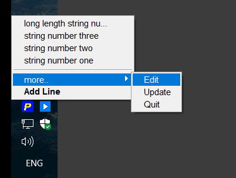

# Pasta

### Описание 

Небольшое легкое графическое приложение, работающее из системного трея. Представляет собой хранилище текста, который был ранее добавлен в буфер обмена. Позволяет иметь быстрый доступ к строке текста по двум кликам.

Сценарий использования - это, например, заполнение различных текстовых форм одинаковыми данными (имя, email и т.п.) без необходимости постоянного поочередного выделения и копирования этого текста из файла. 

### Управление

- `правый клик по иконке` в трее вызывает всплывающее меню, которое состоит из списка ранее добавленных строк и пунктов управления приложением
- `левый клик по любой строке` с текстом заносит ее в системный буфер обмена для последующей вставки куда-либо

- `Add Line` добавит текстовую строку, находящуюся в данный момент в буфере обмена в список строк приложения
- `more` вызывает следующий уровень всплывающего меню, где:
	+ `Edit` - откроет для редактирования текстовый файл с ранее добавленными строками в редакторе, который уставлен в системе по-умолчанию для фалов `*.txt`. Начало текста для представления как отдельного пункта меню обозначается `<>`, окончание - переносом строки.
	+ `Update` - перезагрузит все строки из файла (при их некорректном добавлении) и перерисует пункты меню
	+ `Exit` - выход из приложения (с сохранением всех добавленных строк)

### Особенности

- из буфера обмена добавляется *только текст* (как plain text), все остальное игнорируется

- при удалении строк из файла или добавлении в него вручную новых строк список их в меню *автоматически* обновляется (*file system watch service*)

- операции *добавления, обновления, удаления и копирования* текста в буфер обозначены разными иконками в трее

- реализован собственный *Логер*, который пишет всю активность в log-файл в корневой каталог приложения

- приложение успешно собирается в `*.jar`, и далее запускается и самостоятельно работает в системе, создавая необходимые для своей работы файлы

	

> // Windows bat-file
>
> @echo off
> start javaw -jar Pasta-0.1.jar
> exit 

**В проекте использованы:**

- **Swing** для графического интерфейса
- **Maven** для получения артефакта

---

